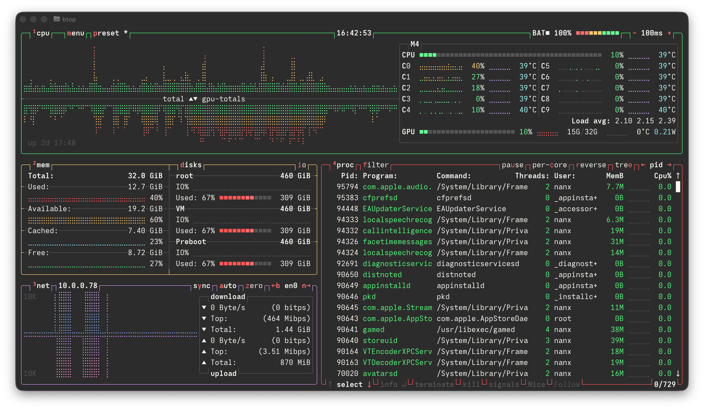

# Anthrosevka Mono

Anthrosevka Mono is an [Iosevka](https://github.com/be5invis/Iosevka)
custom build inspired by the look and feel of Anthropic Mono.




## Installation

Install with Homebrew:

```bash
brew install --cask nanxstats/tap/font-anthrosevka-mono
```

## Prebuilt fonts

Prebuilt fonts are available in the
[GitHub releases](https://github.com/nanxstats/anthrosevka/releases).

The idea is to ship sensible, opinionated defaults for a better experience out of the box:

- Set spacing to "terminal". This forces special symbols such as arrows to fit
  a strict, narrow one-column layout and fixes rendering issues in terminals.
- Width 600 as the default; no condensed version.
- Weights 100 to 900.
- Unhinted TTF, because you deserve to use a high-resolution display.

## Build from source

Follow [building Iosevka from source](https://github.com/be5invis/Iosevka/blob/main/doc/custom-build.md)
to set up the build environment.

```bash
git clone https://github.com/be5invis/Iosevka.git --depth 1
git clone https://github.com/nanxstats/anthrosevka.git

cd anthrosevka/

IOSEVKA_DIR=/path/to/Iosevka

./patches/apply-patches.sh "$IOSEVKA_DIR"
cp private-build-plans.toml "$IOSEVKA_DIR/private-build-plans.toml"

cd "$IOSEVKA_DIR"
npm install
npm run build -- ttf-unhinted::AnthrosevkaMono
```

The built fonts will be in `$IOSEVKA_DIR/dist/AnthrosevkaMono/TTF-Unhinted/`.

See the [patch notes](patches/README.md) for the selected glyph variants and
source level design adjustments.

## Disclaimer

Anthrosevka Mono is an independent third-party project **not** endorsed by,
affiliated with, or supported by Anthropic PBC.

## License

Anthrosevka Mono is licensed under the [SIL Open Font License, Version 1.1](./LICENSE).
